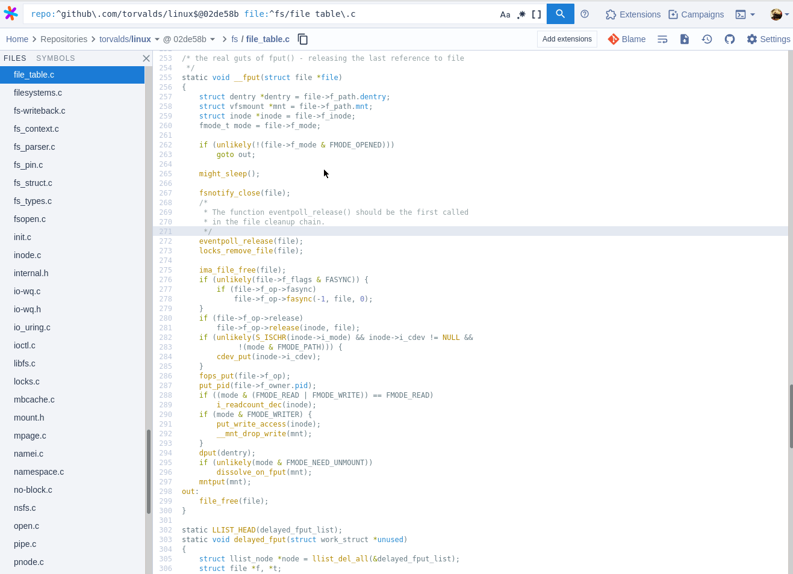

# lsif-clang indexer 



This project is a fork of [clangd](https://clangd.llvm.org/) with patches to add support for outputting [LSIF indexes](https://microsoft.github.io/language-server-protocol/specifications/lsif/0.5.0/specification/). Specifically, a fork of the [llvm-project repo](https://github.com/llvm/llvm-project/) with a new tool `lsif-clang` under the `clang-tools-extra` subdirectory and patches to files under `clang-tools-extra/clangd`. There's more info about the repo structure and its history in the [Forking Strategy](./docs/fork_strategy.md) doc.

This project has only been tested extensively on C++ projects and C projects, but Objective C projects should both be supported as well following the same instructions. See the [compatibility](docs/compatibility.md) page for more detailed information about which kinds of projects are supported.

# Alternatives for C++ Projects

If you can't get `lsif-clang` working with your project, first file an issue! We want this to work everywhere. 
But the C++ ecosystem is fragmented, and it's possible that your project simply won't play nice with the `clang` toolchain. 
[lsif-cpp](https://github.com/sourcegraph/lsif-cpp) is also available, which acts as a plugin for arbitrary C++ compilers and might therefore be compatible. 
Unfortunately, it has several major defects compared to `lsif-clang` (it is much slower and does not provide hovers), and is not the recommended option.

# Usage

Follow the [installation instructions](docs/install.md) to get the tool set up, then the [compilation database](docs/compdb.md) instructions to generate a compilation database. Then run
```sh
lsif-clang compile_commands.json
```
If you get missing header warnings (common on MacOS), you can try
```sh
lsif-clang --extra-arg="-resource-dir=$(clang -print-resource-dir)" compile_commands.json
```
If you are still missing headers, there's likely an error in the way the compilation database was set up, or some generated code that's necessary for C++ compilation hasn't been output yet.

See the [examples](docs/examples.md) of producing LSIF indexes for a variety of OSS repositories to help troubleshoot.

# Testing the output

You can use the [lsif-validate](https://github.com/sourcegraph/lsif-test) tool for basic sanity checking, or [upload the index to a Sourcegraph instance](https://docs.sourcegraph.com/user/code_intelligence/lsif_quickstart) to see the hovers, definitions, and references in action.

# Additional licensing notes

We use the [backwards-cpp](https://github.com/bombela/backward-cpp) code
which is [MIT licensed](https://github.com/bombela/backward-cpp/blob/master/LICENSE.txt).
