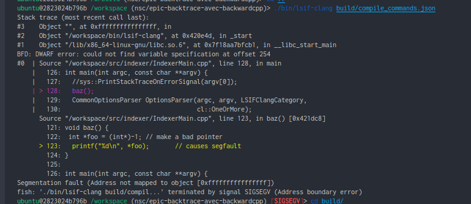

# How to troubleshoot a segfault

This document outlines how to configure your system to provide enough information to debug lsif-clang in the case of a segfault.

## Information to be provided

Along with the information gathered by reading the section below, please also provide:

1. lsif-clang version (commit/tag/etc)
1. Output of `ldd <path to lsif-clang>`
1. lsif-clang source (self-compiled/docker/prebuilt binary)
    - In the case of self-compiled, it may be useful to attach the binary in the bug report
1. One or both of the below (stacktrace/core dump)

## Stacktrace

The lsif-clang indexer has the ability to emit a detailed stacktrace (when possible) as shown in the screenshot below if a segfault is encountered. In the case of the stacktrace not being annotated with source fragments as shown below, we may also ask for a core dump. To shorten the feedback loop, it can be beneficial to include the core dump with the original bug report.

## Core dump

If there's no stacktrace, then the next option is to configure the OS to save a core dump on segfault.

As the process is a bit more involved, we will outline general guidelines for coercing the system to save a core dump.

### Linux

1. Run `ulimit -c unlimited`
1. Check the core-dump handler
    - You can find the configured handler by running `cat /proc/sys/kernel/core_pattern`
    - The output can be either a path with format verbs or a path prefixed by `|` followed by format verbs
    - If the latter, then the binary at that path will be invoked with the core dump and you should read the manual for the given program as to where it stores core dumps and how to proper configure it to do so
    - Else if the former, assuming the aforementioned `ulimit` command was invoked, then it should save the file at that location with the filename based on the format verbs passed
    - e.g `/tmp/core-%e.%p.%h.%t` vs `|/usr/lib/systemd/systemd-coredump %P %u %g %s %t %c %h`
1. Configure the core-dump handler (if necessary)
    - This can be done by running `sysctl -w kernel.core_pattern=<your desired config>` as root

### Docker

If invoking `lsif-clang` from a docker container, the core dump settings are inherited from the host OS (or VM if Mac/Windows).
In this case, it is highly recommended to configure the core pattern to save to a file that can be copied to the host from the container.

### Mac OS

1. Run `ulimit -c unlimited`
1. Make sure `/cores` directory is writeable by the current user
1. And that should be it : )
